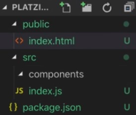
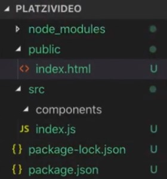

# Apuntes del **curso Practico de React JS** dado por Platzi

Repositorio para el uso didactico en el desarrollo del curso Practico de React JS, junto con el proyecto _"PlayVideo"_ y apuntes del curso ya nombrado.

## **Creando una aplicación con Create React App**

React es una libreria de **JavaScript** para **crear interfaces de usuario**, esta podremos integrarla manualmente para crear nuestra app, pero existe una forma mas **sencilla**, eso es con **Create React App**, que nos ahorrara muchos pasos.

Para crear una aplicación con **Create React App** solo necesitaremos tener versiones de **Node >= 10.16 y npm >= 5.6** instaladas, para instalar la ultima version Node lo podremos descargar [aqui](https://nodejs.org/es/).

Luego de cumplir con los rquisitos podremos hacer uso de nuestra consola de comandos, ejecutando:

```zsh
npx create-react-app <my-app>
```

Con esto se nos generar un carpeta con el nombre ingresado en `<my-app>`, la cual vendra preconfigurada para trabajar en React.

Para desplegar la nuestra app debemos ubicarnos en la capeta en consola e ingresar:
```zsh
npm start
```
Con esto se abrira una nueva pestaña en el navegador, y podremos ver los cambios mientras trabajemos.

_____________________________________________________________________________________________________

## Extención **.jsx**

JSX es una extension de la sintaxis de JavaScript recomendada usarla en React, la cual permite insertar codigo HTML, eso es perfecto para crear elementos React, ejemplo:
```jsx
const element = <h1>Hello Mundo</h1>
```
Permitiendo combinar `js` con `html`
```jsx
const item = {
    name: "Apple",
    price: 4
}
let element = <p>{item.name} : ${item.price} </p>
```
_____________________________________________________________________________________________________


## Compomentes

Los componentes son una caracteristica de React que nos permite modular, idependizar y da lugar a la reeutilizacion del codigo.
Esto nos permite tener una vision mas limpiar y general del codigo (cuando se lleva a cabo buenas practicas).
De estos en react tenemos de 3 tipos, los cuales son:

- **Stateless** o **Componentes funcionales**: 
Se llaman "funcionales" por que literalmente **son una función** de JavaScript, devuelven un **elemento react**, contienen logica y reciben como parametro un objeto "prop"
```jsx
const Stateless = (props) =>{
  const name = props.name;
  const procentage = (props.amount / props.amountTotal) * 100;
    return(
        <h1>There is {procentage}% {name}</h1>
    );
};
```

- **Stateful** o **Componentes de clase**:
Estos estan compuesto por una clase de JavaScript, posee las misma caracteristica que los **stateless**, sin embargo estos tambien poseen estado `state`, ciclo de vida y son capaces de manejar eventos.
```jsx
import React from 'react';

class Stateful extends React.Component {
  constructor(props){
    super(props);
    this.state = {
      hello: 'Hola Mundo'
    }
  }
  render(){
    return(
      <h1>{this.state.hello}</h1>
    )
  }
}
```

- **Presentacionales**:
Estos son los mas basicos de todos, no poseen logica, estados, ni propiedades, es solamente una funcion simple que retorna un elemento.
```jsx
const Presentacional = ()=> <h1>Hola mundo tres veces</h1>;
```

>**Los props jamas deben de ser modificados**

_____________________________________________________________________________________________________

## **Renderizando un componente**

Los componentes en React son **llamados en el DOM** como un **elemento react**, donde sus el **parametro** que recibe el componente no es mas que una **propiedad** del mismo **elemento react**.

Esto quiere decir que si creamos el componente tal que:
```jsx
function Welcome(props) {
  return <h1>Hello, {props.name}</h1>;
}
```
Este lo llamamos asi:
```jsx
const element = <Welcome name="Sara" />;
```
Para luego mandarlo al render en el DOM:
```jsx
ReactDOM.render(
  element,
  document.getElementById('root')
);
```

Recapitulando:
1. **Llamamos** a `ReactDOM.render()` con el **elemento** `<Welcome name="Sara" />`.
2. React llama al **componente** Welcome con `{name: 'Sara'}` como **“props”**.
3. Nuestro **componente Welcome devuelve un elemento** `<h1>Hello, Sara</h1>` como resultado.
4. **React DOM actualiza** eficientemente el DOM para que coincida con `<h1>Hello, Sara</h1>`.


Los componentes pueden ser "llamados" desde otros componentes, asi anillandolos como unas muñecas rusas _mamushka_, formando codigo el cual se puede reciclar facilmente.

>_Apuntes inspirados de la documentacion de React_
_____________________________________________________________________________________________________

## **Ciclo de vida**

**Todos los componentes** en React pasan por una **serie de fases**, en algunos casos no podemos **verlos** como un **bloque de código** y en otros **podemos llamarlos** en nuestro componente para asignar una actividad según sea el caso necesario.

Los componentes pasan por Montaje, Actualización, Desmontaje y Manejo de errores, sin embargo un componente **NO** debe de pasar por todas estas fases, por ejemplo puede pasar por el ciclo de Montaje y Desmontaje sin necesidad de pasar por la actualización.

- ### **Montaje**
    Nuestro componente se **crea**, junto con su logica y sus componentes, para luego ser insertado en el DOM.

    <u>Detalles:</u>

    1. `Constructor()`: Primer metodo en ser llamado, donde en este se inicializan los metodos los controladores y eventos de esta.
    2. `getDerivedStateFromProps()`: Se llama antes de presentarse en el DOM y nos permite actualizar el estado interno en respuesta a un cambio en las propiedades, es considerado un método de cuidado, ya que su implementación puede causar errores sutiles.
    3. `render()`: Este renderiza los elementos en el DOM, en el ingresamos logica y lo que querramos mostrar en el DOM, usualmente se utiliza con `.jsx`.
    4. `ComponentDidMount()`: Aqui es donde trabajamos con eventos para interactuar con nustros componentes.

- ### **Actualización**
    Es Donde nuestro componente esta antento a cambios, los cuales pueden venir atraves de `state` o `props`, lo cual realiza una acción dentro del componente.

    1. `getDerivedStateFromProps()`: Es el primero en ser ejecutado en esta face y funciona de igual manera que en el montaje.
    2. `shouldComponentUpdate()`: Dentro se puede controlar la fase de actualización, devuelve un bool para el caso de querer o no una actualización, es usado para optimización.
    3. `render()`: Genera los cambios en el DOM.
    4. `ComponentDidUpdate()`: Es llamado despues de que se ha actualizado el componente, recibe como argumento las propiedades y el estado, es donde podemos manejar nuestro componente.
    
- ### **Desmontaje**
    Esta etapa es donde el componente "muere", cuando ya no sea necesario el elemento podemos pasar por este ciclo, y de esta forma eliminar el componente del DOM.

    - `componentWIllUnmount()`: Metodo llamado justi antes de que el componente sea destruido o eliminado del DOM.

- ### **Manejo de errores**
    En el caso de que nuestro codigo contenga errores, podemos entrar a esta fase donde podremos entender mejor el error mismo, y que sucede en la app.
    1. `getDerivedStateFromError()`: Este recibe el error como argumento y cualquier valor devuelto por el motodo utilizado para actuazar el estado del componente.
    2. `componentDidCatch()`: Recibe el error como argumento, junto con su información (similar a un catch).

_____________________________________________________________________________________________________

## Manejando **Eventos**

Los eventos son sucesos o cambios dentro de la app, esto puede ser un boton presionado por el usuario, o informacion externa, nuestra app debe de reaccionar ante estos eventos.
En React, reacciona muy similarmente ante a los eventos de HTML y js tradicionales, con unas cuantas diferencias de syntax.

- Considerar usar `.jsx`

Usaremos de ejemplo un componente:
```jsx
class Toggle extends React.Component {
  constructor(props) {
    super(props);
    this.state = {isToggleOn: true};

    // Este enlace es necesario para hacer que `this` funcione en el callback
    this.handleClick = this.handleClick.bind(this);
  }

  handleClick() {
    this.setState(prevState => ({
      isToggleOn: !prevState.isToggleOn
    }));
  }

  render() {
    return (
      <button onClick={this.handleClick}>
        {this.state.isToggleOn ? 'ON' : 'OFF'}
      </button>
    );
  }
}

ReactDOM.render(
  <Toggle />,
  document.getElementById('root')
);
```

Donde el evento se desencadena desde:
```jsx
render() {
    return (
      <button onClick={this.handleClick}>
        {this.state.isToggleOn ? 'ON' : 'OFF'}
      </button>
    );
  }
```

Que ejecuta la funcion:
```jsx
handleClick() {
    this.setState(prevState => ({
      isToggleOn: !prevState.isToggleOn
    }));
```

_____________________________________________________________________________________________________

## **Instalación** y **configuración** de entorno

Para inicializar y configurar correctamente tu proyecto sigue los siguientes pasos en consola:

1. `mkdir <NombreDeLaCarpeta>` para crea tu carpeta
2. `cd <NombreDeLaCarpeta>` entrar en ella
3. `git init` Inicializar **git**
4. `npm init -y` inicializar npm automáticamente

Generar una estructura la cual es un estándar la cual es tal que



Procederemos a **instalar** **React**
```zsh
npm install react react-dom
```

Este nos generara unos archivos en la carpeta, los cuales nos quedaran tal que asi:



Notaremos en nuestro archivo `package.json`, posee unas nuevas dependencias:
```json
"dependencies": {
    "react": "^17.0.2",
    "react-dom": "^17.0.2"
  }
```
_____________________________________________________________________________________________________

## Configurando y dando Compatibilidad con **Babel**

Crearemos un componente, llamado `HelloWorld.jsx` en `./src/componets/HelloWorld.jsx`, el cual es:
```jsx
import React from 'react';

const HelloWorld = () => {
    <h1>Hola Mundo!</h1>
};

export default HelloWorld;
```

Ahora configuraremos nuestro punto de entrada, el archivo `index.js` en `./src/index.js`:
```jsx
import React from "react";
import ReactDOM from "react-dom";
import HelloWorld from "./componets/HelloWorld";

ReactDOM.render(<HelloWorld />, document.getElementById(app));
```
Se renderizara en el DOM nuestro componente `HelloWorld.jsx`.

Para que sea desplegada la app necesitaremos un archivo html, es decir nuestro archivo `index.html` ubicado en `./public/index.html`

```html
<!DOCTYPE html>
<html>
<head>
    <title>Play Video</title>
</head>
<body>
    <div class="app">
        
    </div>
</body>
</html>
```

Finalmente una vez hayamos **configurado correctamente** nuestra base de la app, instalaremos **babel**, con el **comando**:
```zsh
npm install --save-dev @babel/core @babel/preset-env @babel/preset-react babel-loader
```

Para **configurar babel**, debemos de **crear** un nuevo archivo llamado `.babelrc`, el cual ir en la carpeta raiz de proyecto, este archivo contiene:
```json
{
    "presets": [
        "@babel/preset-env",
        "@babel/preset-react"
    ]
}
```

_____________________________________________________________________________________________________

## **Webpack**: Empaquetando nuestros módulos

Webpack es una herramienta que nos ayudara preparar nuestro proyecto, para enviarlo a producción o entorno de desarrollo local.
Lo que hace webpack es como si empaquetada de manera optimizada todo nuestro proyecto y los deja listo para enviar.

Para instalarlo ejecutamos
```zsh
npm install webpack webpack-cli html-webpack-plugin html-loader  --save-dev
```

Una vez instalado, lo configuraremos con un archivo `webpack.config.js` que ubicaremos en la carpeta **raiz**, en este agregaremos:
```js
const path = require('path');
const HtmlWebpackPlugin = require('html-webpack-plugin');

module.exports = {
  entry: './src/index.js',
  output: {
    path: path.resolve(__dirname, 'dist'),
    filename: 'bundle.js',
  },
  resolve: {
    extensions: ['.js', '.jsx'],
  },
  module: {
    rules: [
      {
        test: /\.(js|jsx)$/,
        exclude: [/node_modules/, /apuntes/],
        use: {
          loader: 'babel-loader',
        },
      },
      {
        test: /\.html$/,
        use: {
          loader: 'html-loader',
        },
      },
    ],
  },
  plugins: [
    new HtmlWebpackPlugin({
      template: './public/index.html',
      filename: './index.html',
    }),
  ],
};
```

Una vez "escrito" todo este largisimo codigo _giño giño_, nos moveremos al archivo `package.json`, **agregaremos** un `script`, tal que:
```json
"scripts": {
    "test": "echo \"Error: no test specified\" && exit 1",
    "build": "webpack --mode production"
  }
```

Finalmente una vez hecho todo esto podremos irnos a nuestro proyecto en consola y **ejecutaremos**:
```zsh
npm run build
```

Con esto se creara una carpeta llamada dist, que tendra todo nuestro codigo listo para se desplegado a produccion.

_____________________________________________________________________________________________________

## **Webpack Dev Server**: Reporte de errores y Cambios en tiempo real

Una gran ayuda es por **probar** lo que vamos construyendo, para esto usaremos **Webpack Dev Server**

Instalaremos esto con:
```zsh
npm install webpack-dev-server@3.11.2 -D
```

Ahora solo debemos **crear** un `scrip` en nuestro archivo `package.json`
```json
"scripts": {
    "start": "webpack serve --mode development --env development"
  }
```